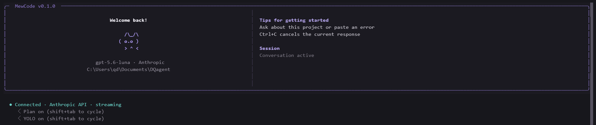
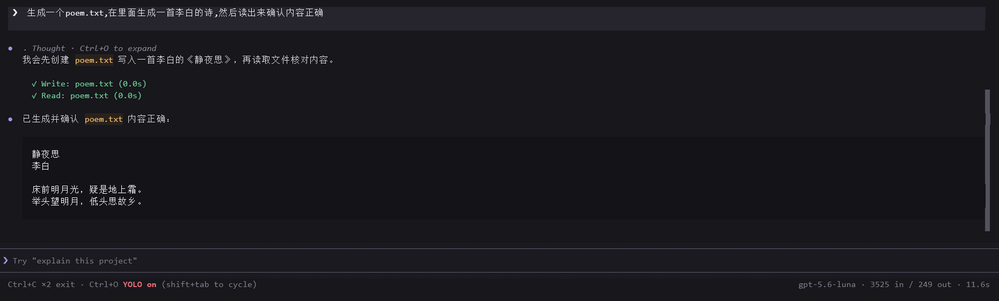
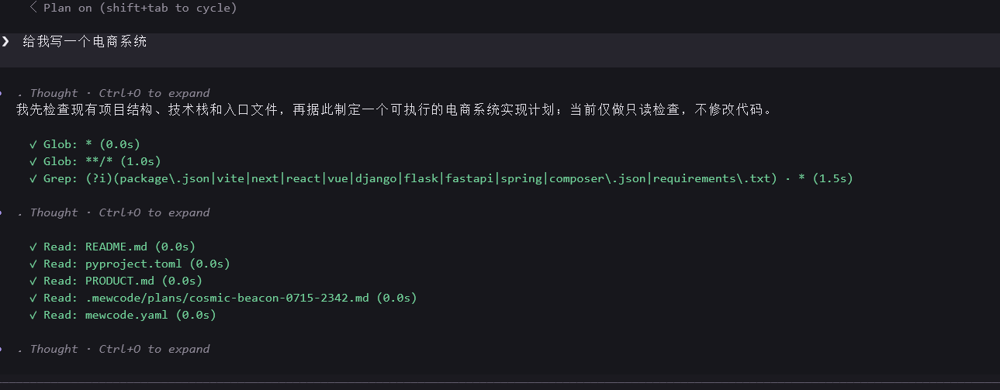
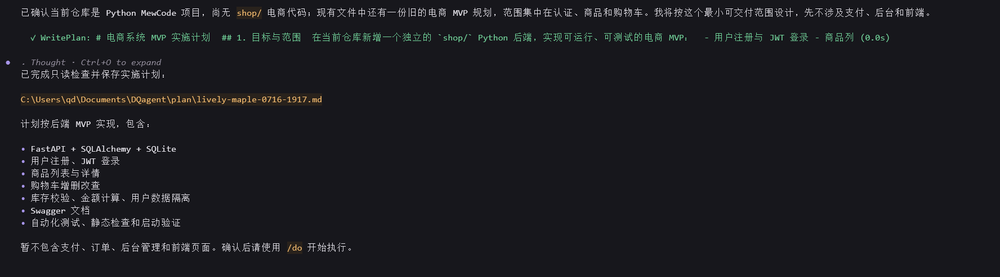
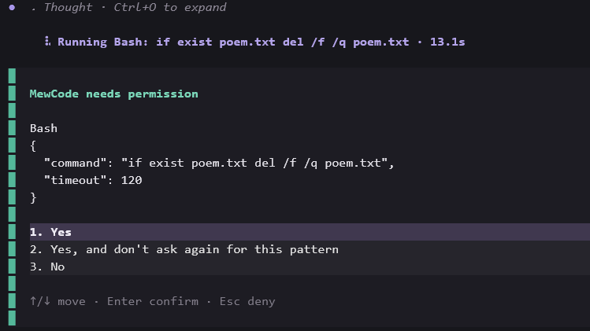
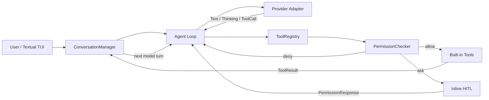

# MewCode

**一个从零搭建的终端 Coding Agent MVP。**

MewCode 使用 Python + Textual 实现，将模型流式输出、结构化工具调用、Agent Loop、
上下文回灌、System Prompt 和权限控制串成一条可运行、可观察、可测试的执行链路。

> 当前完成并验收的是 **CH2–CH6**：Provider 与对话管理、工具系统、Agent Loop、
> System Prompt、权限系统。MCP、长期记忆、完整 Skill/SubAgent/Worktree/AgentTeam 等能力仍在 Roadmap，
> 不作为现成功能展示。

## 界面预览

### 终端原生 TUI

启动后可以看到当前模型、工作目录、连接状态和会话状态；输入、思考、工具调用和结果都在
同一个终端事件流中展示。



### YOLO：连续执行，无确认弹窗

YOLO 模式下，Agent 可以连续完成写文件、回读验证等操作，不进入普通权限确认流程；底栏以
红色常驻提示当前模式。



### Plan：先理解项目，再输出实施计划

Plan 模式只开放只读工具和固定路径的 `WritePlan`。Agent 会先使用 `Glob`、`Grep`、
`ReadFile` 理解仓库，再把实施计划写入独立计划文件，不直接修改业务代码。





### Accept Edits：文件编辑直接执行，命令按需确认

Accept Edits 是默认执行模式。文件写入和编辑可以直接完成；删除文件等 Bash 操作会显示内联
权限选择，用户可以单次允许、按模式永久允许或拒绝。



## 已实现能力

| 模块 | 状态 | 当前实现 |
|---|:---:|---|
| Provider 与流式对话 | ✅ | Anthropic Messages API、OpenAI Responses API、统一异步事件、Extended Thinking、多轮对话 |
| 工具系统 | ✅ | 统一 `Tool` Contract、Pydantic 参数校验、内置文件/搜索/Bash 工具、结构化错误 |
| Agent Loop | ✅ | 工具调用收集、执行、结果回灌、自动进入下一轮、串并行批次、最大轮次与取消 |
| 上下文基础治理 | ✅ | token 预算、自动压缩、超长工具结果落盘、模型可见结果预览 |
| System Prompt | ✅ | 分区 Prompt Builder、环境上下文、普通/协调/Plan 身份约束、动态 reminder |
| 权限系统 | ✅ | 危险命令检测、路径沙箱、三层 YAML 规则、HITL、Plan 豁免、三种 TUI 模式 |
| MCP / 长期记忆 / 完整 Skill / SubAgent / Worktree / AgentTeam | ⏳ | 后续规划，不属于当前完成范围 |

## Agent 如何工作



一次完整工具闭环：

```text
模型流式输出
  → 产生结构化 ToolCall
  → Pydantic 校验参数
  → 权限系统判定 allow / ask / deny
  → 执行工具并产生 ToolResult
  → 将结果写回 ConversationManager
  → Agent 继续下一轮模型调用
  → 输出最终回答
```

### 核心模块边界

- **Provider Adapter**：将不同厂商的 SDK 事件转换成统一 `StreamEvent`，Agent 不依赖具体协议。
- **ConversationManager**：保存文本、Thinking、ToolUse 和 ToolResult，并按 Provider 协议序列化。
- **Agent Loop**：管理模型与工具之间的循环、停止条件、错误恢复、并发和上下文预算。
- **ToolRegistry**：统一工具 schema、参数模型、类别、并发属性与执行入口。
- **PermissionChecker**：在模型之外处理危险命令、路径范围、规则、模式和用户确认。
- **Textual TUI**：消费 Agent 事件，展示流式回答、思考、工具状态和内联交互。

## 内置工具

| 工具 | 类别 | 功能 |
|---|---|---|
| `ReadFile` | read | 分段读取带行号的 UTF-8 文件 |
| `WriteFile` | write | 创建或覆盖文件，自动创建父目录 |
| `EditFile` | write | 对唯一匹配文本执行精确替换 |
| `Bash` | command | 执行命令，返回 stdout、stderr、退出码和超时 |
| `Glob` | read | 按 glob 查找文件，支持精确文件名递归回退 |
| `Grep` | read | 按正则搜索代码，可限制文件模式 |
| `ToolSearch` | read | 按需发现延迟注册工具 |
| `AskUserQuestion` | read | 在 Agent Loop 中发起结构化用户问题 |
| `WritePlan` | plan only | 仅在 Plan 模式写入当前计划文件 |

工具失败会作为结构化结果返回模型，不会直接终止 TUI。超长结果保存在
`.mewcode/sessions/`，只把结果预览和文件位置回灌给模型；声明为并发安全的相邻只读工具可
并行执行。

## 三种执行模式

使用 `Shift+Tab` 按以下顺序循环，底栏始终显示当前模式：

```text
Accept Edits → Plan → YOLO → Accept Edits
```

| 模式 | 快捷入口 | 文件读写 | Bash / command | 权限弹窗 |
|---|---|---|---|---|
| **Accept Edits** | 默认、`/do` | 读写直接执行 | 安全白名单直放，其余询问 | 按需显示 |
| **Plan** | `/plan` | 只读；仅 `WritePlan` 可写计划文件 | 拒绝 | 不显示 |
| **YOLO** | `/mode yolo` | 直接执行 | 通过硬安全层后直接执行 | 不显示 |

YOLO 跳过可配置规则和 HITL，但仍保留两层不可绕过边界：硬编码危险命令检测和项目路径沙箱。
例如 `rm -rf /` 或访问项目/临时目录之外的路径仍会被拒绝。

## 快速开始

### 1. 安装

需要 Python 3.11+，推荐使用 [uv](https://docs.astral.sh/uv/)：

```powershell
git clone https://github.com/qd-maker/coding-agent.git
cd coding-agent
uv sync --extra dev
```

也可以使用 pip：

```powershell
python -m pip install -e ".[dev]"
```

### 2. 配置

```powershell
Copy-Item mewcode.yaml.example mewcode.yaml
$env:ANTHROPIC_API_KEY = "your-key"
```

默认配置示例：

```yaml
provider:
  name: default
  protocol: anthropic
  model: claude-sonnet-4-6
  base_url: https://api.anthropic.com
  api_key: ${ANTHROPIC_API_KEY}
  thinking: true

system_prompt: You are MewCode, a concise and helpful coding assistant.
```

OpenAI 兼容配置：

```yaml
provider:
  name: default
  protocol: openai
  model: gpt-5.5
  base_url: https://api.openai.com/v1
  api_key: ${OPENAI_API_KEY}
  thinking: false
```

配置发现顺序：当前目录的 `mewcode.yaml`，然后是 `~/.mewcode/config.yaml`。也可以使用
`--config` 显式指定路径。

### 3. 运行

```powershell
uv run mewcode
# 或
uv run python -m mewcode
```

## 为什么采用 spec / tasks / checklist

这个项目使用 AI-assisted / vibe coding 完成，但没有把自然语言对话本身当作需求和验收依据。
每个章节都先拆成三份文档：

```text
spec.md      明确目标、功能需求、非功能需求、Out of Scope、完成定义
tasks.md     拆分实现步骤、文件影响、依赖关系和交付标准
checklist.md 把“完成”转换成可搜索、可运行、可观察的验收证据
```

编码前先维护 [`docs/api-contract.md`](docs/api-contract.md)，编码后执行测试和静态检查。这套方式
不能消除模型错误，但能显著减少长任务中的目标漂移、漏接主流程、只生成死代码以及“看起来
完成了”的错误判断。

章节状态和三件套索引位于 [`docs/README.md`](docs/README.md)；更完整的学习复盘见
[`docs/learning-notes.md`](docs/learning-notes.md)。

## 关于“AI 项目最大的坑”

目前我的答案是：**最大的坑不是模型不会生成代码，而是模型的不确定性沿调用链累积后，系统
仍然可能给出一个看起来合理的完成结果。**

- 模型说“已修改”，工具可能没有真正执行。
- 工具执行成功，结果可能没有正确写回上下文。
- AI 可以生成完整模块，但模块可能没有接入 Agent 主流程。
- Prompt 中的安全要求会被遗忘，不能代替程序化权限边界。
- 上下文持续增长会同时增加成本、延迟和错误理解的概率。
- Vibe coding 可以快速产生代码，也会快速产生“代码很多，所以已经完成”的错觉。

MewCode 目前的应对方式是：统一事件和数据 Contract、结构化工具结果、明确停止条件、程序化
权限层、分层上下文预算，以及以 checklist 和自动测试验证完成声明。

## 验证

```powershell
uv run python -m compileall -q mewcode tests
uv run ruff check mewcode tests
uv run mypy mewcode
uv run pytest -q
```

当前回归结果：

```text
167 passed, 1 skipped
```

跳过项是 Windows 未授予符号链接创建权限时的 symlink escape 测试；其余 Provider、对话、
工具、Agent Loop、Prompt、权限系统和 TUI 用例均执行。

## 项目结构

```text
mewcode/
├── agent.py              # Agent Loop、事件、工具执行与恢复
├── client.py             # Anthropic / OpenAI Provider Adapter
├── conversation.py       # Provider-neutral 对话与工具块
├── context.py            # token 预算、压缩、超长结果落盘
├── prompts.py            # System Prompt Builder
├── app.py                # Textual TUI
├── permission_dialog.py  # AskUser / 权限内联交互
├── permissions/          # 模式、危险检测、路径沙箱、规则、Checker
└── tools/                # Tool Contract 与内置工具

docs/
├── api-contract.md
├── ch2/ ... ch6/         # spec / tasks / checklist
├── assets/               # 真实运行截图
└── learning-notes.md
```

## Roadmap（尚未完成）

- CH7：MCP 协议与外部工具接入
- CH8：项目级上下文选择与管理
- CH9：可解释、可删除、可验证的跨会话记忆
- CH10：完整 Slash Command 系统
- CH11：可发现、可装载、可约束的 Skill 系统
- CH12：完整 Hook 生命周期和配置体验
- CH13：SubAgent 调度、隔离和结果合并
- CH14：Git Worktree 隔离执行
- CH15：长期协作 AgentTeam、Mailbox 与共享任务

仓库中的实验性脚手架不代表上述章节已达到 CH2–CH6 相同的完成与验收标准。

## 操作提示

- `Shift+Tab`：循环 Accept Edits、Plan、YOLO。
- `/plan`：进入 Plan 模式。
- `/do`：返回 Accept Edits。
- `/mode yolo`：进入 YOLO。
- `Ctrl+O`：展开或收起 Extended Thinking。
- 生成期间按一次 `Ctrl+C`：取消当前回复。
- 空闲时 1.5 秒内连续按两次 `Ctrl+C`：退出。
- `Ctrl+L`：清空当前显示，不删除对话历史。

## License

当前仓库尚未附加开源许可证。代码默认保留所有权利；如需复用，请先联系仓库作者。
